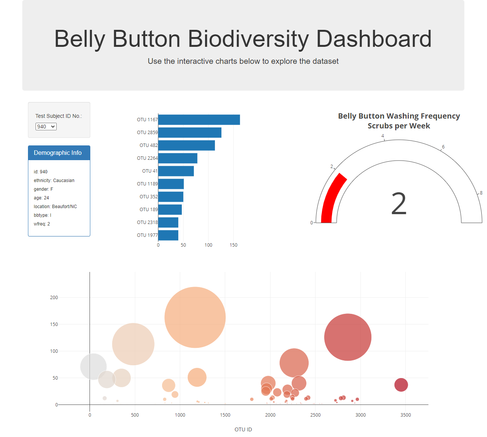

# Plotly-BellyButtonBiodiversity

The task in this assignment, was to build an interactive dashboard to explore the [Belly Button Biodiversity dataset](http://robdunnlab.com/projects/belly-button-biodiversity/), which catalogs the microbes that colonize human navels.

The dataset reveals that a small handful of microbial species (also called operational taxonomic units, or OTUs, in the study) were present in more than 70% of people, while the rest were relatively rare.

## Step 1: Plotly

1. The D3 library was used to read in `samples.json`.

2. A horizontal bar chart was created with a dropdown menu to display the top 10 OTUs found in that individual.

* The `sample_values` were used as the values for the bar chart.

* The`otu_ids` were used as the labels for the bar chart.

* The `otu_labels` were used as the hovertext for the chart.

3. The bubble chart is created that displays each sample.

* The `otu_ids` were used for the x values.

* The `sample_values` were used for the y values.

* The `sample_values` were used for the marker size.

* The `otu_ids` were used for the marker colors.

* The `otu_labels` were used for the text values.

4. The sample metadata, i.e., an individual's demographic information is displayed.

5. Each key-value pair from the metadata JSON object is displayed on the page.

6. All of the plots are updated any time a new sample is selected.

## Advanced Challenge Assignment

* The Gauge Chart is adapted from <https://plot.ly/javascript/gauge-charts/> to plot the weekly washing frequency of the individual.

* The example gauge code is modified to account for values ranging from 0 through 9.

* The chart is updated whenever a new sample is selected.

The final page created is as follows:

## Deployment

* The app is deployed to a free static page hosting service, GitHub Pages : 
[BellyButtonBiodiversityApp](https://vijetaputhran.github.io/Plotly-BellyButtonBiodiversity/)
 